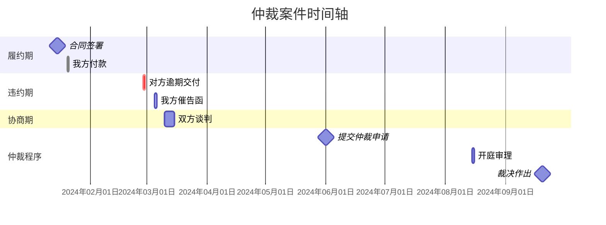

# 仲裁可视化 - 仲裁时间轴图谱专家


## 快速开始

创建仲裁时间轴图谱的步骤：

1. **事实萃取** - 从仲裁文书/材料中提取关键法律事实节点
2. **视觉呈现** - 生成可视化时间轴（推荐HTML格式）
3. **明细输出** - 附带事件明细表和综合分析

## 仲裁化术语对照表

| 诉讼术语 | 仲裁对应术语 | 说明 |
|---------|-------------|------|
| 法院 | 仲裁庭/仲裁委员会 | 争议解决机构 |
| 原告 | 申请人 | 发起方 |
| 被告 | 被申请人 | 相对方 |
| 起诉 | 提交仲裁申请 | 程序启动 |
| 答辩 | 提交答辩书 | 回应程序 |
| 判决/裁定 | 裁决书/决定书 | 终局文件 |
| 上诉 | 撤销裁决申请（法院）/不予执行申请 | 救济途径 |
| 庭审 | 开庭审理 | 事实调查程序 |
| 举证期限 | 举证期限（仲裁规则约定） | 证据提交时限 |
| 一审/二审 | 仲裁程序（一裁终局） | 审级特点 |
| 诉讼时效 | 仲裁时效 | 时效期间 |

## 工作流程

### 第一步：事实萃取

仔细阅读输入的仲裁文书/案情概要，提取所有关键法律事实节点：

**必须提取的事件类型：**
- 📄 合同签署/仲裁协议达成
- ✍️ 签名/盖章行为
- 💰 付款/收款行为
- 📦 交货/提供服务
- ⚠️ 违约事实/瑕疵交付
- 📢 催告/通知/函件（含催告函、律师函）
- 💬 协商/谈判（含和解协商）
- ⚖️ 提交仲裁申请/答辩/开庭审理
- 📋 裁决书/调解书
- 🔄 撤销裁决/不予执行/执行程序

**时间精度要求：**
- 精确到年月日（如：2024年3月15日）
- 无法确定日期时标注：
  - "月初"（1-10日）
  - "月中"（11-20日）
  - "月末"（21-31日）
  - "某年某月"（仅知道月份）

**事实归类：**
- 我方行为（申请人/被申请人视角） - 时间轴上方标注
- 对方行为 - 时间轴下方标注
- 争议焦点 - 用特殊标记突出（🔴 或 ⭐）

### 第二步：视觉呈现

根据事实节点生成可视化图表。

#### Mermaid 甘特图格式（用于电子展示）



#### HTML时间轴格式（推荐用于打印）

创建HTML文件，包含完整的可视化时间轴，支持直接A4打印。

#### ASCII 时间轴格式（备用）

```
                              我方行为              时间轴               对方行为
    ────────────────────────────────────────────────────────────────────────────────
    2024-01-15  [📄] 签署《买卖合同》（含仲裁条款）                      ←─────────────────────────
                      │
    2024-01-20  [💰] 支付首期款 50万元                              ←─────────────────────────
                      │
    2024-02-28                                                       ─────────────────→ [⚠️] 逾期交付
                      │
    2024-03-05  [📢] 发送律师催告函                                  ←─────────────────────────
                      │
    2024-06-01  [⚖️] 向XX仲裁委员会提交仲裁申请                      ←─────────────────────────
                      │
    2024-08-15  [⚖️] 开庭审理                                        ←─────────────────────────
                      │
    2024-09-20  [📋] 仲裁庭作出裁决书                                  ←─────────────────────────
    ────────────────────────────────────────────────────────────────────────────────
    图例：📄合同  ✍️签署  💰付款  ⚠️违约  📢通知  ⚖️仲裁程序  🔴争议焦点
```

#### 色彩编码规范

| 仲裁阶段 | 推荐颜色 | RGB值 | HEX代码 |
|---------|---------|------|---------|
| 履约期 | 天蓝 | 135, 206, 250 | #87CEEB |
| 违约期 | 柔和珊瑚红 | 255, 127, 80 | #FF7F50 |
| 协商期 | 淡黄 | 255, 255, 224 | #FFFFE0 |
| 仲裁程序期 | 淡紫 | 221, 160, 221 | #DDA0DD |
| 执行/救济期 | 金色 | 255, 215, 0 | #FFD700 |

### 第三步：输出结构化内容

## A4打印页面布局规范（重要）

创建可直接打印的输出时，必须遵循以下三页布局：

### 第1页：时间轴图谱
**页面内容：**
- 标题：案件名称 + "仲裁时间轴图谱"（标题最多两行，长标题使用`<br>`手动换行）
- 案件基本信息：案号、案由、仲裁机构、关键标识（如合同号、仲裁条款）
- 完整时间轴：所有事件按时间顺序排列
  - 每个阶段独立分组显示
  - 使用颜色区分不同阶段
  - 标注事件日期、图标、事件内容、证据

### 第2页：事件明细表
**页面内容：**
- 标题：案件名称 + "事件明细表"
- 案件基本信息：案号、仲裁机构
- 法律阶段划分表：阶段、时间区间、状态、时长
- 仲裁程序时间统计：从申请到裁决、从关键节点到裁决
- 完整事件明细表：序号、时间、事件、证据、法律意义、主体

### 第3页：综合分析
**页面内容：**
- 标题：案件名称 + "综合分析"
- 案件基本信息：裁决日期、案由等
- 争议焦点提炼：
  - 核心争议焦点（🔴 标记）
  - 辅助争议点（⭐ 标记）
  - 每个争议点列明：申请人主张、被申请人主张、仲裁庭认定
- 证据链完整性：列出所有证据材料及状态
- 案件结果分析：各程序结果汇总表
- 仲裁程序信息表（左栏）/ 案件基本信息表（右栏）：双栏布局
- 案件总结：简要概述案件经过和最终结果

### HTML输出格式规范

**CSS页面设置：**
```css
@page {
    size: A4 portrait;
    margin: 1.2cm;
}

.page {
    width: 210mm;
    min-height: 297mm;
    padding: 1.2cm;
    page-break-after: always;
}

.page:last-child {
    page-break-after: avoid;
}
```

## 仲裁特殊事项处理

### 仲裁协议效力审查

在时间轴中特别标注：
- **仲裁协议签署时间**：作为仲裁管辖权基础
- **仲裁机构选择**：明确约定的仲裁委员会
- **仲裁范围**：仲裁协议覆盖的争议范围

### 仲裁程序关键节点

| 节点 | 时限规定（参考） | 标注要求 |
|------|------------------|----------|
| 提交仲裁申请 | 仲裁时效内（一般2年，特殊另有规定） | ⚖️ 高亮 |
| 被申请人答辩 | 收到通知后15日（可依仲裁规则调整） | 📋 必须标注 |
| 举证期限 | 仲裁庭指定或当事人约定 | 📋 必须标注 |
| 开庭通知 | 开庭前合理期限（通常10-15日） | ⚠️ 提醒 |
| 裁决作出 | 组庭后4-6个月（简易程序更短） | 📋 必须标注 |
| 裁决送达 | 作出后送达双方 | 📋 必须标注 |

### 一裁终局特性说明

与诉讼不同，仲裁实行**一裁终局**制度：
- 时间轴不显示"上诉"环节
- 如有撤销/不予执行程序，单独标注为"司法监督程序"
- 执行程序单独列为"执行阶段"

## 输入材料处理建议

### 常见输入类型及处理要点

**仲裁申请书/答辩状**
- 关注仲裁请求和事实理由
- 提取主张的时间节点
- 标注举证责任分配（仲裁规则）

**证据清单**
- 关联证据页码到具体事件
- 注意证据形成时间与事件时间的匹配
- 标注关键证据

**合同文书（含仲裁条款）**
- 签署时间、地点、主体
- **仲裁条款内容**：仲裁机构、仲裁地点、适用规则
- 履约期限和关键时间节点
- 违约条款对应的时间条件

**往来函件**
- 发送时间、接收时间（如有）
- 函件性质（催告、通知、律师函）
- 法律效力（中断仲裁时效、解除权行使等）

**裁决书/调解书**
- 提取案件事实认定的时间节点
- 仲裁庭对关键时间点的认定
- 裁决主文和履行期限

### 输入材料不完整时的处理

1. **时间不明确**：标注为"约XX年XX月"或"XX年XX月上/中/下旬"
2. **主体不清晰**：在表格备注栏说明
3. **证据缺失**：在证据页码栏标注"待补充"
4. **争议事实**：双方主张分别列出，用分号或换行分隔
5. **时间跨度大**：使用"~"符号表示期间

## 质量检查清单

输出前检查以下项目：

### 内容完整性
- [ ] 所有关键事实节点均已提取
- [ ] 时间精度符合要求（精确到日或标注模糊度）
- [ ] 图标系统使用正确
- [ ] 色彩编码符合规范
- [ ] 争议焦点已明确标注
- [ ] 仲裁协议/仲裁条款已特别标注
- [ ] 仲裁程序关键节点完整

### 表格完整性
- [ ] 事件明细表信息完整（序号、时间、事件、证据、法律意义、主体）
- [ ] 法律阶段划分清晰
- [ ] 证据链列出所有关键证据
- [ ] 仲裁程序时限信息准确

### 打印布局
- [ ] 第1页：时间轴单独完整，不跨页
- [ ] 第2页：事件明细表单独完整，不跨页
- [ ] 第3页：综合分析内容合理布局
- [ ] 每页都有页码标注
- [ ] 字号适合A4打印（不小于9pt）
- [ ] 边距合理（1.2cm）

### 视觉效果
- [ ] 颜色柔和专业
- [ ] 重点内容突出
- [ ] 黑白打印时可读
- [ ] 标题不超过两行

## 风格原则

1. **专业冷静** - 使用柔和色系，避免鲜艳刺眼
2. **逻辑清晰** - 时间推进一目了然
3. **重点突出** - 争议焦点醒目标注
4. **证据绑定** - 每一事件关联证据来源
5. **提交友好** - 适合仲裁庭审和客户展示
6. **布局规范** - 严格遵循三页A4打印布局
7. **仲裁特色** - 突出仲裁协议、一裁终局、程序灵活性等特点


